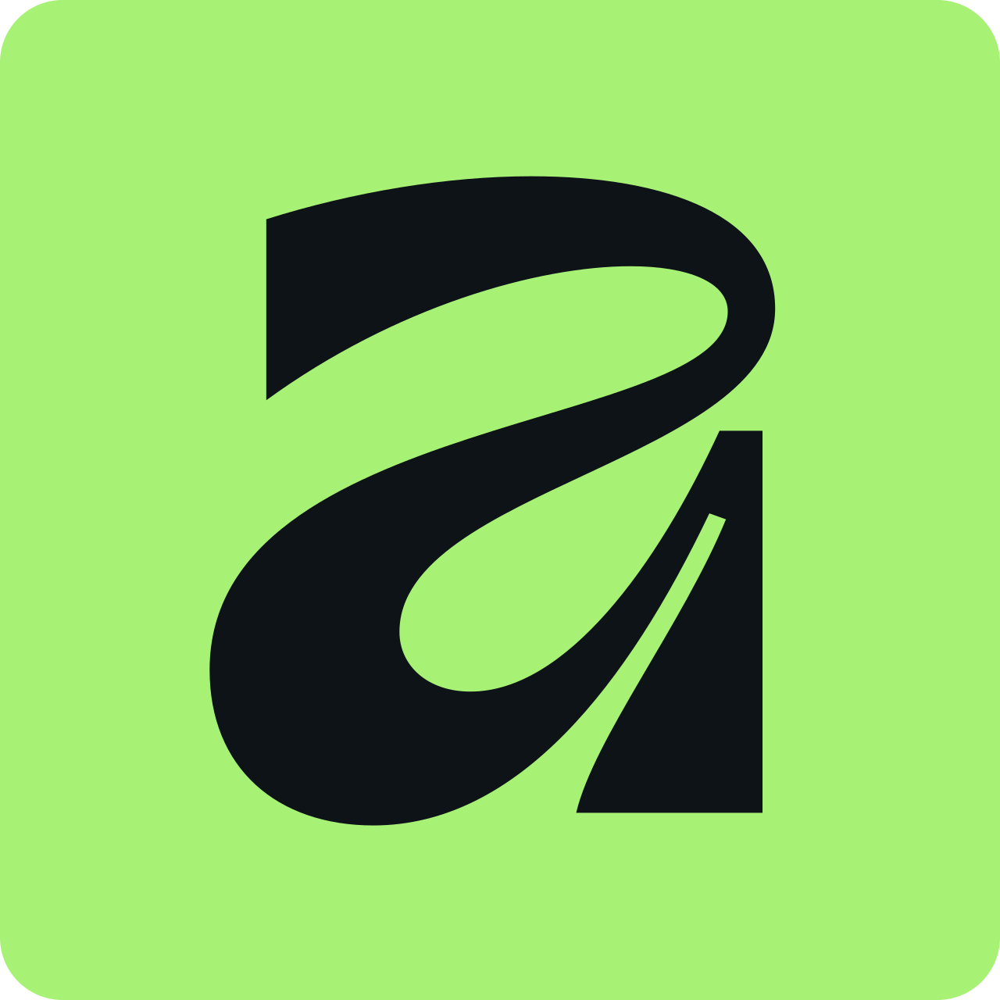
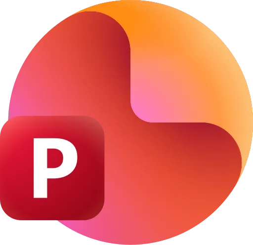
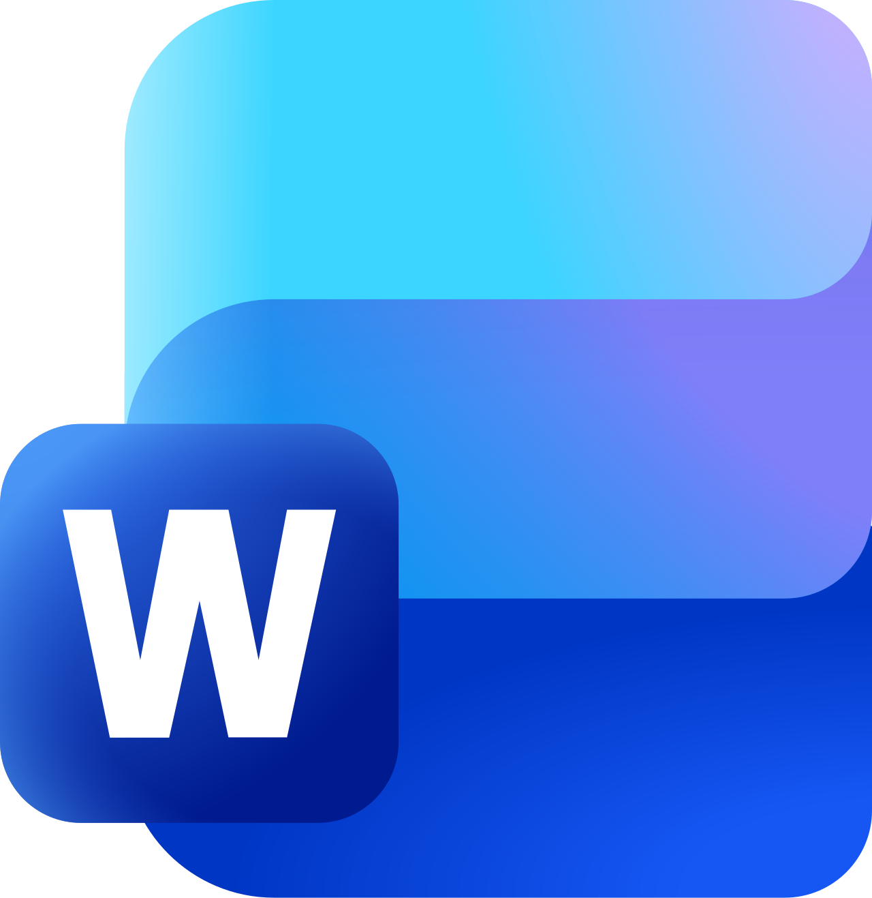
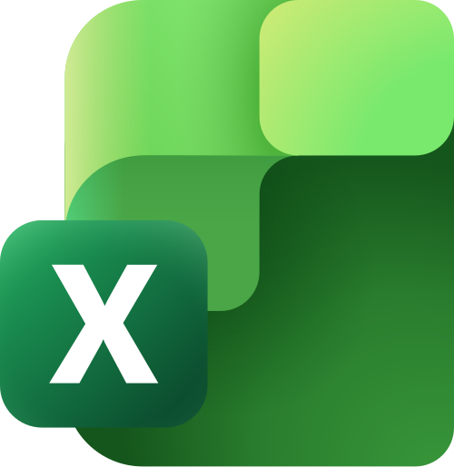

  

 

  
<b><strong>Sobre mim</strong></b> <i>(Clique para ler)</i>

   
  Acredito que o bom software nasce na interseção exata entre a engenharia estruturada e o design fluido. Minha trajetória acadêmica tem uma particularidade: começou no <b>Jornalismo</b> antes de migrar para a <b>Ciência da Computação</b>. Isso me deu uma visão muito específica sobre desenvolvimento — a tecnologia precisa se comunicar bem, engajar e ter empatia com quem a usa.  
  Trato o frontend com o mesmo rigor lógico que aplico ao backend. Seja estruturando a arquitetura de um app ou criando vetores personalizados, o objetivo é criar experiências dinâmicas e com propósito.

---

### Stacks & Ferramentas

**Linguagens & Banco de Dados**
 

  

**Frontend, Mobile & UI/UX**
 

  

**Design, Edição & Produtividade**
 

---

### Meus projetos/trabalhos

**Em Forca**
Um jogo mobile nativo que vai muito além de um passatempo clássico. O projeto funcionou como um laboratório prático de persistência local, integração de banco de dados SQL e gerenciamento de estado fluido na tela do usuário.  

  

**Make it!**
Uma aplicação multiplataforma focada na organização de rotinas e gestão de tarefas em grupo. O projeto inteiro passa por um design system meticuloso prototipado antes de chegar à implementação em código.

  

**Landing Pages & Interfaces**
Desenvolvimento de páginas com foco em altíssima conversão, animações fluidas e design moderno. Um espaço onde exploro a fundo componentes web (Next.js/React) para criar um impacto visual forte desde o primeiro scroll.

 

*E muitos outros!*

---

### Onde me encontrar

  
  
  
  
  

